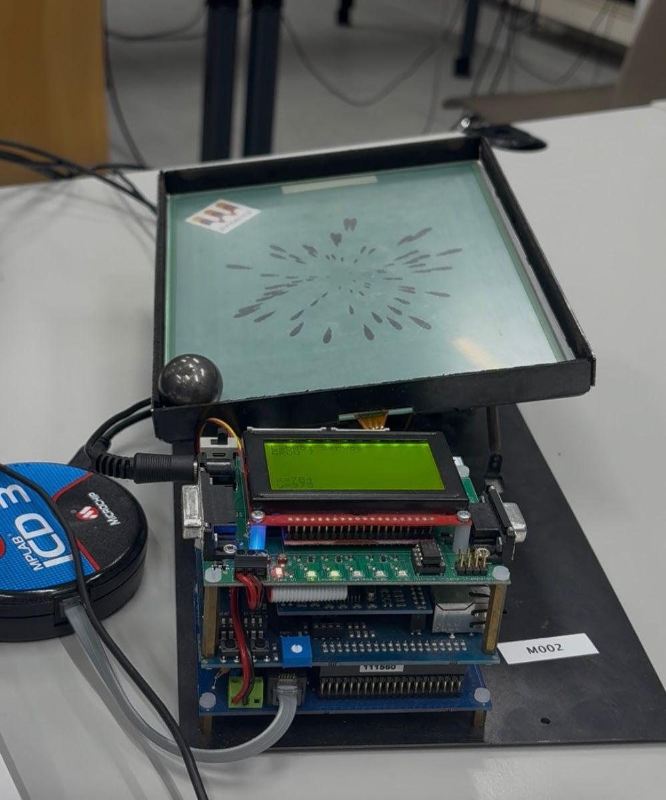

Real-Time Ball-on-Plate Control with dsPIC Microcontroller
##Overview

This project implements a real-time Ball-on-Plate control system using a dsPIC microcontroller. The goal is to stabilize a ball on a 2D plate and perform trajectory tracking, demonstrating embedded control, 
sensor integration, and feedback-based actuation.

##Features:

ADC readings for ball position measurement

Butterworth filter applied to smooth sensor signals

PID controller to regulate plate tilt

PWM control of servo motors

Trajectory tracking: the ball can be moved in a circular path on the plate

Real-time embedded control using dsPIC microcontroller

##Implementation:

Hardware: dsPIC microcontroller, servomotors, position sensors on the plate(analog)

Software: C code running on the microcontroller

Control loop:

Read ball position via ADC

Apply Butterworth filter(low-pass digital filter) to remove noise

Compute PID control signals

Generate PWM to drive servo motors

Track desired trajectory (circle)

Here is the experimental setup:

